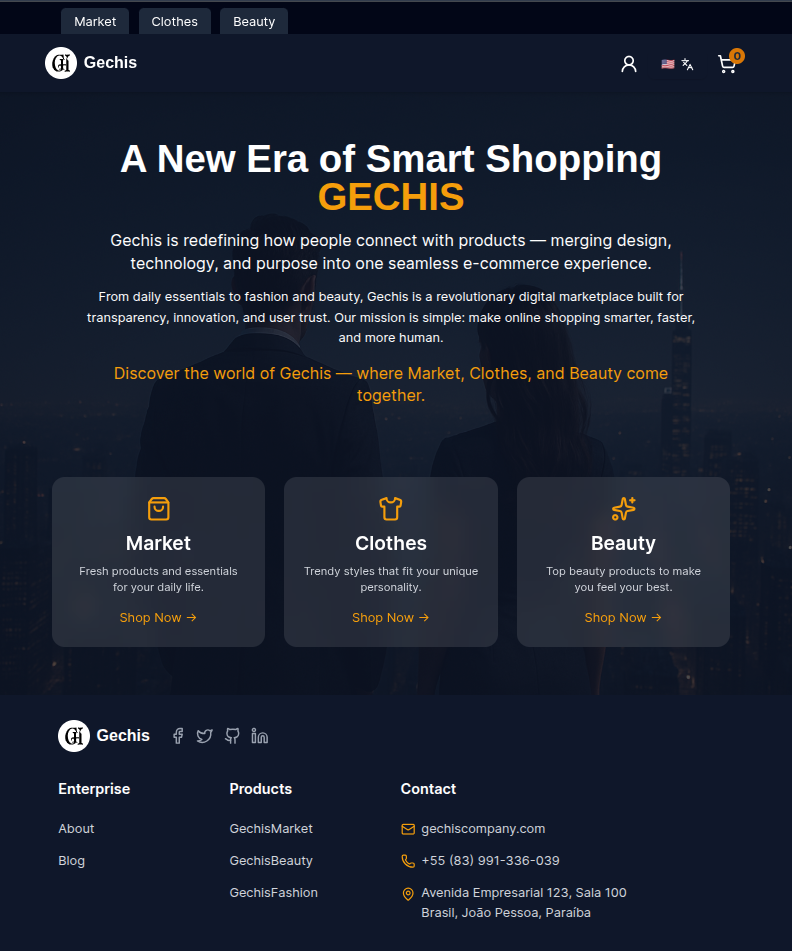
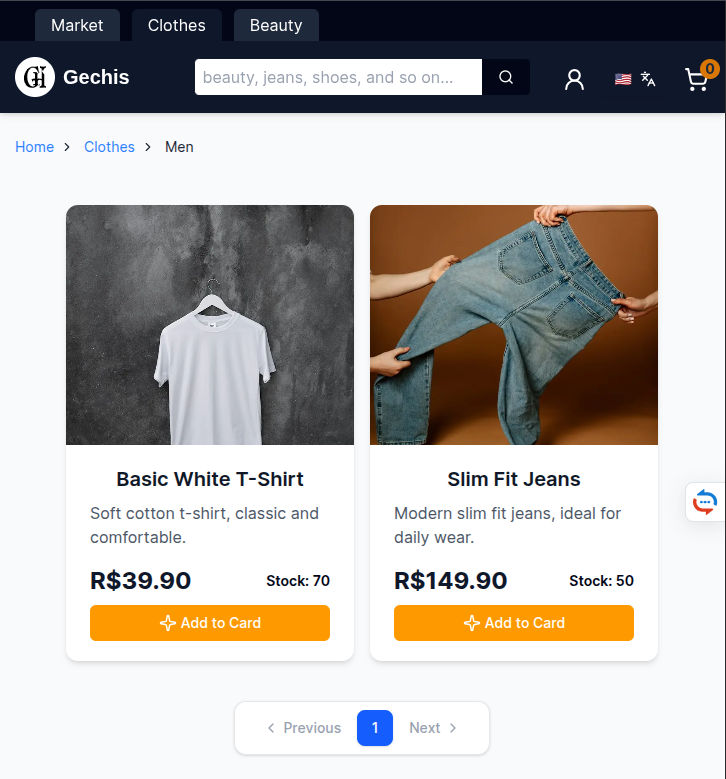

# 🛒 E-Commerce Project (Work in Progress)

This is my second front-end project. I am building a complete e-commerce
application to practice real development skills and improve my
portfolio.

Right now, the project includes:

- Product listing
- Product search
- product details
- Skeleton loaders
- Pagination
- UI components with Next.js and shadcn

## 🚧 Next Features

These features are coming soon:

- User dashboard\
- Admin dashboard\
- More filters (price, category, etc.)\

## 🛠️ Tech Stack

- **Next.js 16**\
- **React**\
- **TypeScript**\
- **Tailwind CSS**\
- **shadcn.**\
- **Prisma**\
- **PostgreSQL**\
- **Vercel** (deployment)

## 📦 Installation

```bash
git clone https://github.com/your-username/your-repo
cd your-repo
pnpm install
pnpm run dev
```

## 📁 Project Status

This project is **still in development (WIP)**.\
I will continue updating the repository with new features.

## 📸 Products


